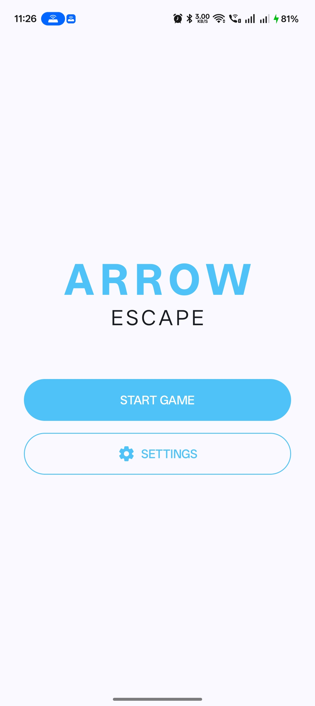
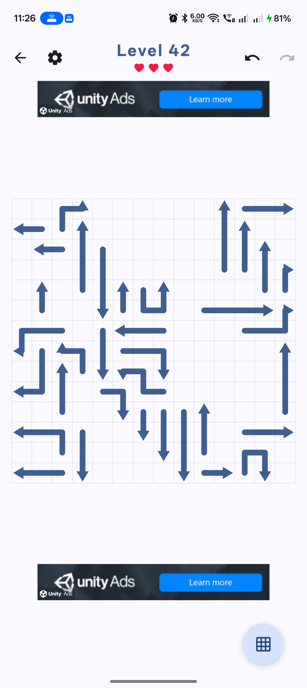
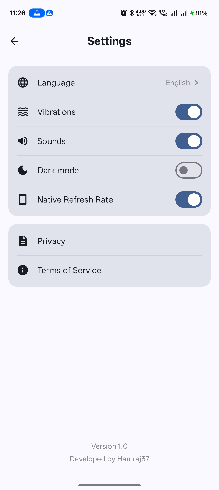

# Arrow Puzzle Game

Arrow is a modern, minimalist puzzle game built with Jetpack Compose. Players must strategically tap arrows to make them fly off the grid without colliding with other arrows.

## Features

- **Challenging Puzzles**: Procedurally generated levels that increase in complexity as you progress.
- **Strategic Gameplay**: Use logic and timing to clear the grid.
- **Undo/Redo System**: Made a mistake? Quickly backtrack with full history support.
- **Fluid Animations**: Smooth, snake-like arrow movements powered by Compose Canvas.
- **Monetization**: Integrated Unity Ads for banners and rewarded videos to continue after game over.
- **Customizable Experience**:
    - Dark/Light mode support.
    - Sound and Vibration toggles.
    - High-refresh rate optimization for compatible devices.

## Screenshots

<p align="center">
  
  
  
</p>

## Tech Stack

- **UI**: [Jetpack Compose](https://developer.android.com/jetpack/compose) for a fully declarative UI.
- **Architecture**: MVVM with `StateFlow` and `ViewModel`.
- **Navigation**: [Navigation 3](https://developer.android.com/jetpack/compose/navigation) (Next-gen Android Navigation).
- **Persistence**: 
    - [Room](https://developer.android.com/training/data-storage/room) for structured data.
    - [DataStore](https://developer.android.com/topic/libraries/architecture/datastore) for user preferences.
- **Ads**: [Unity Ads SDK](https://unity.com/solutions/monetize) for monetization.
- **Utilities**: 
    - [Hilt](https://developer.android.com/training/dependency-injection/hilt-android) (Planned/Integrated).
    - [Coroutines](https://kotlinlang.org/docs/coroutines-overview.html) for asynchronous tasks.

## Setup

### Unity Ads
To enable Unity Ads, you need to add your IDs to `local.properties`:

```properties
UNITY_GAME_ID=your_game_id
UNITY_REWARDED_ID=your_rewarded_placement_id
UNITY_BANNER_ID=your_banner_placement_id
UNITY_TEST_MODE=true
```

### Signing
For release builds, ensure you provide the Base64 encoded keystore in `local.properties`:

```properties
SIGNING_KEY_STORE_BASE64=your_base64_keystore
SIGNING_KEY_ALIAS=your_alias
SIGNING_STORE_PASSWORD=your_password
SIGNING_KEY_PASSWORD=your_password
```

## GitHub Actions

The project includes a CI/CD pipeline (`.github/workflows/android.yml`) that automatically builds and signs the release APK and App Bundle when triggered. Ensure you have the corresponding secrets configured in your GitHub repository settings.

## License

This project is licensed under the MIT License.
